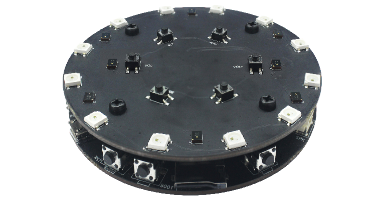

# ESP32-Korvo V1.1用户指南

* [English Version](../../../en/hw-reference/esp32/user-guide-esp32-korvo-v1.1.md)

本指南介绍了乐鑫的开发板 ESP32-Korvo V1.1。

ESP32-Korvo V1.1 是一个基于双核 ESP32、搭载麦克风阵列的音频开发板，配合乐鑫语音识别 SDK ESP-Skainet，适用于远场低功耗语音识别应用，例如智能语音面板、语音插座、智能语音开关等。

ESP32-Korvo V1.1

本指南包括如下内容：

* [入门指南](#1-入门指南): 简要介绍了 ESP32-Korvo V1.1 和硬件、软件设置指南。
* [硬件参考](#2-硬件参考): 详细介绍了 ESP32-Korvo V1.1 的硬件。
* [相关文档](#3-相关文档): 列出了相关文档的链接。

# 1. 入门指南

本节介绍了如何快速上手 ESP32-Korvo V1.1。开头部分介绍了 ESP32-Korvo V1.1，[开始开发应用](#14-开始开发应用) 小节介绍了怎样在 ESP32-Korvo V1.1 上安装模组、设置和烧录固件。

## 1.1 概述

ESP32-Korvo V1.1 由两块开发板组成，集成多个外设：主板包含 ESP32-WROVER-B 模组、USB 电源接口、micro SD 卡槽、耳机连接器和扬声器连接器，子板包含麦克风阵列、功能键和 RGB LED 灯，两板由 FPC 排线相连。

不同于乐鑫其他的音频开发板，ESP32-Korvo V1.1 用单颗 ESP32 芯片实现远场本地语音识别，支持双麦和三麦阵列，配合波束成形 (beamforming)、AEC 等语音增强算法，满足多种场景下的语音识别需求。

## 1.2 内含组件和包装

### 1.2.1 零售订单

如购买样品，每个 ESP32-Korvo V1.1 将单独包装，内含：

* ESP32-Korvo V1.1 主板
* ESP32-Korvo V1.1 子板
* FPC 排线
* 8 个螺丝
* 4 个螺柱

零售订单请前往 <https://www.espressif.com/zh-hans/company/contact/buy-a-sample>。

### 1.2.2 批量订单

如批量购买，开放版将以大纸板箱包装。

批量订单请参考[乐鑫产品订购信息](https://www.espressif.com/sites/default/files/documentation/espressif_products_ordering_information_cn.pdf) (PDF) 。

## 1.3 组件介绍

ESP32-Korvo V1.1 主板正面

ESP32-Korvo V1.1 子板正面

ESP32-Korvo V1.1 子板背面

|主要组件|介绍|
|:- |:- |
|ESP32-WROVER-B|这款 ESP32 模组内置 ESP32 芯片、128 Mbit SPI flash 和 64 Mbit PSRAM，可灵活存储数据，具有 Wi-Fi / BT 连接和数据处理能力。|
|电源稳压器|5 V 转 3.3 V 稳压器。|
|电源开关|拨动至 On，开发板上电；拨动至 Off，开发板断电。|
|电池接口|连接电池。|
|USB 电源接口|为开发板供电。|
|USB 转 UART 接口|电脑和 ESP32-WROVER-B 之间的通信接口。|
|USB 转 UART 桥接器|单芯片 USB-UART 桥接器，可提供高达 3 Mbps 的传输速率。|
|Reset 键|按住此键使系统复位。|
|Boot 键 |下载按键。按住 Boot 键的同时按一下 EN 键进入"固件下载"模式，通过串口下载固件。|
|Micro SD 卡槽| 适用于需要扩充数据存储空间或备份的应用开发场景。|
|音频模数转换器| 高性能四通道音频模数转换器，其中三个通道用于麦克风，一个通道用于回声消除 (AEC) 功能。|
|音频功率放大器|放大外接扬声器的音频信号，最大至 3 W。|
|音频编解码器|音频编解码器 ES8311 通过 I2S 总线将数字信号转换为模拟信号与 ESP32 通信。|
|扬声器连接器|外接扬声器。|
|耳机连接器| 外接耳机。|
|FPC 连接器|连接主板和子板。|
|模拟麦克风|三个模拟麦克风阵列，间隔 65 mm。|
|RGB LED|12 个可寻址红绿蓝发光二极管 (WS2812)。|
|Function 键 |六个功能键，分别是 PLAY, SET, VOL -, VOL +, MODE 和 REC。这六个功能键可由用户定义。|

## 1.4 默认固件说明

ESP32-Korvo V1.1 [默认固件](https://github.com/espressif/esp-skainet/blob/master/tools/default_firmware/esp32_korvo_v1_1_fw_v0_1_20200323.bin)通过控制板载 RGB LED，展示唤醒功能和命令词识别功能。

ESP32-Korvo V1.1 （用 FPC 排线连接主板和子板）上电后，您可使用默认唤醒词“嗨，乐鑫”唤醒开发板。唤醒后，板载的 12 个 RGB LED 将被循环点亮为白色，表示设备正在等待命令词。

|默认固件支持的命令词|设备反馈|
|:- |:- |
|关闭电灯|熄灭 RGB LED|
|打开白灯|打开 RGB LED，显示白色。|
|打开红灯|打开 RGB LED，显示红色。|
|打开绿灯|打开 RGB LED，显示绿色。|
|打开蓝灯|打开 RGB LED，显示蓝色。|
|打开黄灯|打开 RGB LED，显示黄色。|
|打开橙灯|打开 RGB LED，显示橙色。|
|打开紫灯|打开 RGB LED，显示紫色。|

如果没有识别到命令词，RGB LED 将恢复至唤醒前的状态。

## 1.5 开始开发应用

通电前，请确保 ESP32-Korvo V1.1 完好无损。

### 1.5.1 必备硬件

* ESP32-Korvo V1.1
* 两根 USB 2.0 数据线（标准 A 型转 Micro-B 型）
* 4 欧姆扬声器或耳机
* 电脑（Windows、Linux 或 macOS）

### 1.5.2 硬件设置

1. 使用 FPC 排线连接 ESP32-Korvo V1.1 子板和 ESP32-Korvo V1.1 主板。
2. 将 4 欧姆扬声器接至扬声器连接器，或将耳机接至耳机连接器。
3. 使用两根 USB 数据线连接电脑与 ESP32-Korvo V1.1 的两个 USB 接口。
4. 打开电源开关。
5. 电源指示 LED 应该亮红灯。

### 1.5.3 软件设置

如果硬件设置已完成，请准备开发工具。前往 [ESP-Skainet 软件准备](https://github.com/espressif/esp-skainet/blob/master/README_cn.md#esp-skainet-english) 查看以下步骤：

1. [获取 ESP-IDF](https://github.com/espressif/esp-skainet/blob/master/README_cn.md#esp-idf)，配置基于 ESP32 的 C 语言 PC 开发环境。
2. [获取 ESP-Skainet](https://github.com/espressif/esp-skainet/blob/master/README_cn.md#esp-skainet)，运行乐鑫智能语音助手。在 ESP-Skainet 下使用 [ESP-SR](https://github.com/espressif/esp-skainet/blob/master/README_cn.md#esp-sr)，查询和调用 ESP-Skainet 所需要的 API，包括唤醒词识别、语音命令词识别和前端声学算法。
3. [编译、烧写和运行 ESP-Skainet 示例](https://github.com/espressif/esp-skainet/blob/master/README_cn.md#示例)。

# 2. 硬件参考

## 2.1 功能框图

ESP32-Korvo V1.1 的主要组件和连接方式如下图所示。

ESP32-Korvo V1.1 功能框图

# 3. 相关文档

* [ESP32-Korvo V1.1 主板原理图](https://dl.espressif.com/dl/schematics/ESP32-KORVO_V1.1_schematics.pdf) (PDF)
* [ESP32-Korvo V1.1 子板原理图](https://dl.espressif.com/dl/schematics/ESP32-KORVO-MIC_V1.1_schematics.pdf) (PDF)
* [ESP32-Korvo V1.1 主板 PCB 布局](https://dl.espressif.com/dl/schematics/ESP32-Korvo-Mainboard_V1.1_PCB_Layout.pdf) (PDF)
* [ESP32-Korvo V1.1 子板 PCB 布局](https://dl.espressif.com/dl/schematics/ESP32-Korvo-Mic_V1.1_PCB_Layout.pdf) (PDF)
* [ESP32 技术规格书](https://www.espressif.com/sites/default/files/documentation/esp32_datasheet_cn.pdf) (PDF)
* [ESP32-WROVER-B 技术规格书](https://www.espressif.com/sites/default/files/documentation/esp32-wrover-b_datasheet_cn.pdf)(PDF)
* [ESP32-WROVER-B V1.0 参考设计](https://www.espressif.com/sites/default/files/documentation/ESP32-WROVER-B_Reference_Design_V1-r1.0_0.zip) (ZIP)
* [乐鑫产品订购信息](https://www.espressif.com/sites/default/files/documentation/espressif_products_ordering_information_cn.pdf)  (PDF)
